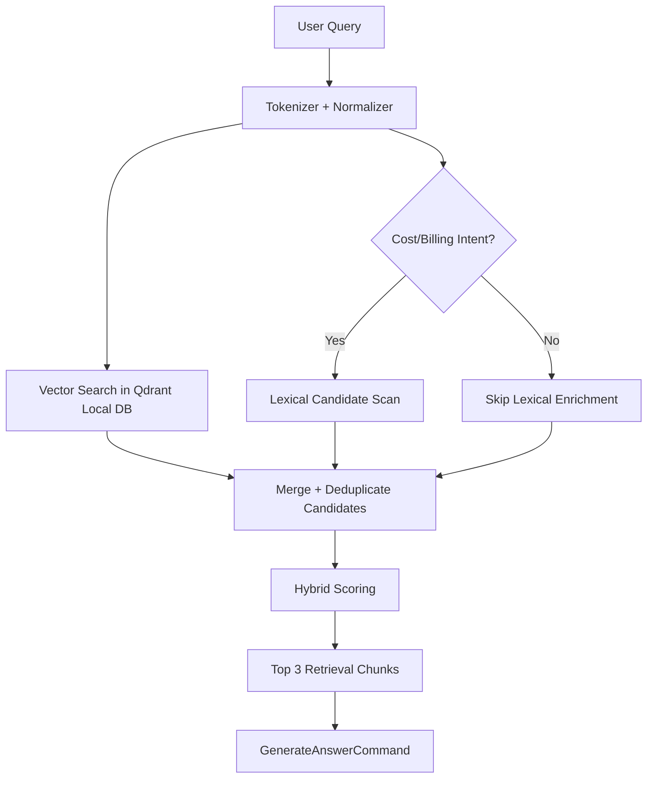

# Knowledgebase Project

Internal Knowledge Assistant backend built with FastAPI and a retrieval-first RAG pipeline.

## System Architecture & Processing Pipeline

The application features a robust end-to-end pipeline that synchronizes local documents into a highly queryable conversational search engine.

### 1. Automated Data Ingestion
**How it works:** 
The application utilizes a `LocalDirectoryConnector` that dynamically scans a flexible list of directories configured by `DATA_SCAN_DIRECTORIES`. It natively parses `.json` generated chat exports and `.docx` binary files. Over a background thread controlled by `AUTO_INGESTION_ENABLED`, the backend aggressively resyncs these files at an interval to keep the index fresh without human intervention.
**Why we chose this:** 
Hardcoding static connectors restricted flexibility. Abstracting the file processing into a dynamic directory scanner allows engineering teams to drop new knowledge modules (e.g., `proj_3/documents`) into the data folder and instantly have them ingested without modifying code. The internal background thread removes the need for external cron jobs.

### 2. Structure-Aware Chunking
**How it works:** 
Once text is extracted, it is passed to `ChunkDocumentCommand`. This uses an overlapping, contextual token builder that aggregates short paragraphs up to the defined `chunk_size_tokens`. It gracefully bounds overlapping tail tokens exactly inside the chunk's maximum ceiling limit. If a massive run-on sentence exceeds the limits, it recursively splits it by token capacity.
**Why we chose this:** 
Traditional chunkers indiscriminately output tiny chunks for short paragraphs (like 20-word chat bursts), destroying surrounding context and causing retrieval failure. Our structure-aware strategy stitches those small fragments contextually until reaching optimal density, dramatically boosting retrieval relevance.

### 3. Embedding Generation
**How it works:** 
Chunks are transformed into 384-dimensional semantic vectors using the `HuggingFaceEmbedder` powered by the `sentence-transformers/all-MiniLM-L6-v2` model via the remote HuggingFace Inference API. The system performs dynamic batching, embedding sequences in high volumes concurrently instead of linearly.
**Why we chose this:** 
`all-MiniLM-L6-v2` offers the best balance of extremely fast generation, zero local hardware requirements, and highly accurate semantic grouping. The dynamic batching directly prevents 429 Rate Limit errors inherent to the free HF tier while executing 100x faster than linear loops. (There is also a deterministic `HashTokenEmbedder` fallback in case the API is offline.)

### 4. Vector Storage & Retrieval
**How it works:** 
The embedded chunks are upserted into Qdrant (`qdrant_local`), a local file-backed high-performance vector database. Upon receiving a query, the retriever normalizes the prompt, identifies intent, and runs a **Hybrid Scoring** system (Semantic Overlap + Keyword Overlap + Recency Prior + Trust Prior) to rank the vectors before passing the top few to the `GenerateAnswerCommand` (powered by `DeepSeek-R1`).
**Why we chose this:** 
`qdrant_local` avoids the operational overhead of a Docker container or managed cloud DB while matching their vector search speeds. The Hybrid Scoring pipeline specifically helps surface precise numeric records (like Cloud Billing costs) which pure vector similarity frequently ignores.

---

## Retrieval Flow Diagram



## Project Structure

- `app/api/` FastAPI routes
- `app/services/` orchestration services
- `app/commands/` business logic commands
- `app/rag/` retrieval logic
- `app/ingestion/` connectors + ingestion indexing pipeline
- `app/data/` base datasets storage
- `app/models/` shared Pydantic models and enums
- `app/core/` configuration, logging, HF client, shared store

## Run This Project

From project root:

```bash
python -m venv .venv
source .venv/bin/activate
python -m pip install --upgrade pip
python -m pip install -e ".[dev]"
python -m pip install uvicorn
```

Start server:

```bash
# Start server with background auto-ingestion initialized
uvicorn app.main:app --reload --host 0.0.0.0 --port 8000
```

## Required Setup for DeepSeek-R1 & API Embeddings

Set your Hugging Face API token in `.env`:

```dotenv
HF_API_TOKEN=<your_hf_token>
HF_LLM_ENABLED=true
HF_MODEL_ID=deepseek-ai/DeepSeek-R1
HF_CHAT_COMPLETION_URL=https://router.huggingface.co/v1/chat/completions
```

## Environment Variables (`.env`)

Core:
- `SERVICE_NAME`
- `API_PREFIX`

Ingestion Scheduler & Target Scanning:
- `DATA_BASE_DIR`: Base relative path (default `app/data`)
- `DATA_SCAN_DIRECTORIES`: Comma-separated list of child folders (default `chat_data,documents`)
- `AUTO_INGESTION_ENABLED`: If true, spawns daemon thread on boot to continually ingestion data.
- `AUTO_INGESTION_INTERVAL_SECONDS`: Background sync frequency.
- `AUTO_INGESTION_MODE`

Hugging Face / LLM:
- `HF_LLM_ENABLED`
- `HF_API_TOKEN`
- `HF_MODEL_ID`

Vector DB:
- `VECTOR_DB_PROVIDER` (usually `qdrant_local`)
- `VECTOR_DB_PATH`
- `VECTOR_DB_DIMENSION`

## Run Tests

```bash
.venv/bin/python -m pytest -q
```
