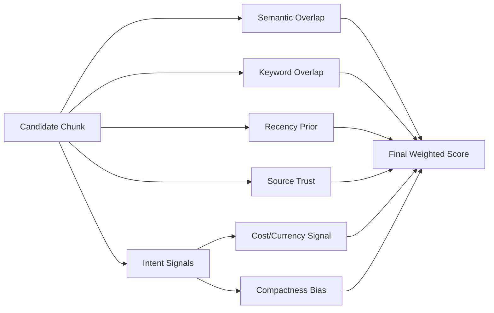

# Knowledgebase Project

Internal Knowledge Assistant backend built with FastAPI and a retrieval-first RAG pipeline.

## What This Project Does (Current Mode)

The application now serves answers from **local static datasets**:
- chat data from `app/data/chat_data/*.json`
- document data from `app/data/documents/*.docx`

Answer generation is wired to Hugging Face chat completions using:
- `deepseek-ai/DeepSeek-R1`

Authentication is intentionally deferred and not implemented yet.

## Why Integration Code Is Commented

Third-party connectors (Teams/SharePoint/Jira API integrations) are intentionally **paused** for now.

You will see explicit comments in code where default wiring was switched to static connectors. Those comments exist so future maintainers understand:
- why integration connectors are currently not active
- why static connectors were added
- how to re-enable integrations later without rebuilding from scratch

## How It Works

1. API receives a user query.
2. Service triggers retriever + answer command.
3. Retrieval runs over indexed chunks stored in local vector DB (Qdrant local mode by default).
4. Index is built from static connectors:
   - `LocalChatDataConnector`
   - `LocalDocumentsConnector`
5. `GenerateAnswerCommand` calls Hugging Face DeepSeek-R1 when configured.
6. If HF call fails (for example missing token), deterministic fallback formatting is used so the app remains available.

## Retriever Under The Hood

The retriever is not a single lookup; it is a staged ranking pipeline:

1. Query normalization (tokenization + stopword removal + light singular normalization).
2. Vector candidate pull from vector DB.
3. Intent-aware enrichment:
   - for cost/billing questions, lexical candidates are added from in-memory index records.
4. Hybrid scoring of each candidate:
   - semantic overlap
   - keyword overlap
   - recency prior
   - source trust prior
   - intent-specific signals (for cost queries: currency/cost signal + compactness bias)
5. Top 3 chunks are forwarded to answer generation.

### Retrieval Flow Diagram


### Hybrid Scoring Diagram



### Why This Helps Cloud-Cost Questions

- Cost queries often need numeric facts (for example `$18,200/month`).
- Pure vector similarity can miss those short factual snippets.
- The lexical enrichment + cost-signal scoring path increases precision for these direct-fact prompts.

## Project Structure

- `app/api/` FastAPI routes
- `app/services/` orchestration services
- `app/commands/` business logic commands
- `app/rag/` retrieval logic
- `app/ingestion/` connectors + ingestion indexing pipeline
- `app/data/` local static datasets (chat + documents)
- `app/models/` shared Pydantic models and enums
- `app/core/` configuration, logging, HF client, shared store
- `tests/` test suite
- `docs/` architecture/plans/guardrails

## Run This Project

From project root:

```bash
python -m venv .venv
source .venv/bin/activate
python -m pip install --upgrade pip
python -m pip install -e ".[dev]"
python -m pip install uvicorn
```

Start server:

```bash
uvicorn app.main:app --reload --host 0.0.0.0 --port 8000
```

API URL:
- `http://127.0.0.1:8000`

## Required Setup for DeepSeek-R1

Set your Hugging Face token in `.env`:

```dotenv
HF_API_TOKEN=<your_hf_token>
HF_LLM_ENABLED=true
HF_MODEL_ID=deepseek-ai/DeepSeek-R1
HF_CHAT_COMPLETION_URL=https://router.huggingface.co/v1/chat/completions
```

If `HF_API_TOKEN` is empty or invalid, the app logs an LLM failure and returns deterministic fallback output.

## Static Data Ingestion

Active static data folders:
- `app/data/chat_data`
- `app/data/documents`

Run indexing manually:

```bash
python - <<'PY'
from app.ingestion.indexing_pipeline import IngestionIndexingPipeline
from app.models.enums import ConnectorMode

result = IngestionIndexingPipeline().run(mode=ConnectorMode.FULL)
print(result.model_dump())
PY
```

## Local Vector DB (Qdrant)

The project uses a local, file-backed vector database by default:
- Provider: `qdrant_local`
- Storage path: `app/vector_db/qdrant`
- Collection: `knowledgebase_chunks`

Relevant `.env` keys:
- `VECTOR_DB_PROVIDER` (`qdrant_local` or `inmemory`)
- `VECTOR_DB_PATH`
- `VECTOR_DB_COLLECTION_NAME`
- `VECTOR_DB_DIMENSION`
- `VECTOR_DB_TOP_K`

If you want a clean index, remove local artifacts and re-run indexing:

```bash
rm -rf app/vector_db/qdrant
```

## Environment Variables (`.env`)

Core:
- `SERVICE_NAME`
- `API_PREFIX`
- `LOG_LEVEL`
- `LOG_DIR`
- `LOG_FILE_NAME`

Ingestion scheduler:
- `AUTO_INGESTION_ENABLED`
- `AUTO_INGESTION_INTERVAL_SECONDS`
- `AUTO_INGESTION_MODE`

Static data:
- `STATIC_CHAT_DATA_DIR`
- `STATIC_DOCUMENTS_DIR`
- `STATIC_PROJECT_KEY`
- `STATIC_CONFIDENTIALITY`

Hugging Face / LLM:
- `HF_LLM_ENABLED`
- `HF_API_TOKEN`
- `HF_MODEL_ID`
- `HF_CHAT_COMPLETION_URL`
- `HF_TIMEOUT_SECONDS`
- `HF_MAX_TOKENS`
- `HF_TEMPERATURE`

Vector DB:
- `VECTOR_DB_PROVIDER`
- `VECTOR_DB_PATH`
- `VECTOR_DB_COLLECTION_NAME`
- `VECTOR_DB_DIMENSION`
- `VECTOR_DB_TOP_K`

Legacy integration config (kept for future reactivation):
- `TEAMS_*` keys remain in config but are not default pipeline sources right now.

## Manual API Testing with Swagger

1. Start server.
2. Open `http://127.0.0.1:8000/docs`.
3. Use `GET /api/v1/query`.
4. Enter a query.
5. Execute and inspect response.

ReDoc:
- `http://127.0.0.1:8000/redoc`

## Quick cURL Check

```bash
curl "http://127.0.0.1:8000/api/v1/query?query=Summarize%20the%20proposal%20and%20chat%20decisions"
```

## Logging

- Default log file: `app/logs/app.log`
- Logs are structured JSON lines.

## Run Tests

```bash
.venv/bin/python -m pytest -q
```

## Reference

Hugging Face chat completion task docs:
- https://huggingface.co/docs/inference-providers/tasks/chat-completion
